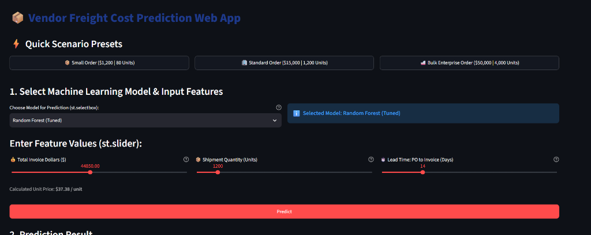
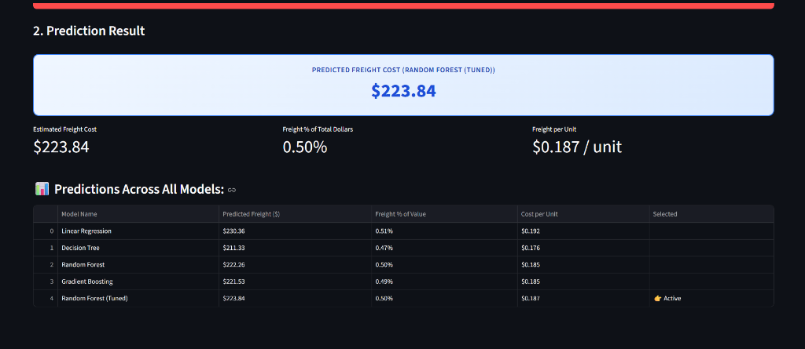

# ADSFA2: Freight Cost Prediction & Streamlit Deployment

[](https://www.python.org/)
[](https://streamlit.io/)
[](https://scikit-learn.org/)
[](https://adsfa2-machine-learning.streamlit.app/)
[](https://drive.google.com/file/d/1o6S9N0j77qM4fd9kbdE2gw2V1TVeh5Ey/view?usp=sharing)

## 🌐 Live Application
> 🚀 **Live Demo URL**: **[https://adsfa2-machine-learning.streamlit.app/](https://adsfa2-machine-learning.streamlit.app/)**  
> Access the deployed interactive web portal directly in your browser without local setup.

---

## 📸 Web Application Interface Preview
| Scenario Presets & Feature Sliders | Real-Time Predictions & Consensus Grid |
| :---: | :---: |
|  |  |

---

## 📌 Project Overview
This project builds an end-to-end Machine Learning solution to predict commercial vendor freight costs from the internal SQLite database (`data/inventory.db`, table: `vendor_invoice`). Developed for **Formative Assessment-02**, it demonstrates:
1. **Data Acquisition & Preprocessing**: Rigorous EDA, outlier capping (IQR), feature engineering (`days_po_to_invoice`, `Price_per_Unit`), and standard scaling.
2. **Model Implementation & Benchmarking**: Implementation of 4 distinct regression architectures + GridSearchCV tuning.
3. **Model Deployment**: Interactive Streamlit application (`app.py`) allowing model selection, scenario presets, and real-time multi-model comparison.
4. **Final Deliverables**: Executed Jupyter notebook (`notebooks/eda_and_modeling.ipynb`), interactive Streamlit app (`app.py`), and comprehensive executive HTML report ([`FA2_Report.html`](FA2_Report.html)).

---

## 🗄️ Dataset Details & Download
- **Local File**: `data/inventory.db` (Table: `vendor_invoice`, 5,543 records)
- **📥 Download Link**: [Google Drive Database Download Link](https://drive.google.com/file/d/1o6S9N0j77qM4fd9kbdE2gw2V1TVeh5Ey/view?usp=sharing)
- **Target Variable**: `Freight` (Continuous shipping fee in USD)
- **Engineered Features**: `Quantity`, `Dollars`, `days_po_to_invoice`, `Price_per_Unit`

---

## 📂 Project Structure
```text
ADSFA2/
├── app.py                          # Streamlit web application (Model Deployment)
├── requirements.txt                # Python package dependencies
├── README.md                       # Project documentation
├── data/
│   └── inventory.db                # SQLite database with vendor invoice records
├── notebooks/
│   └── eda_and_modeling.ipynb      # Executed Jupyter Notebook with complete EDA & models
├── src/
│   ├── data_preprocessing.py       # Data cleaning, feature engineering, IQR capping, scaling
│   ├── train.py                    # Model training, GridSearchCV tuning, and serialization
│   └── model_evaluation.py         # Regression evaluation metrics and comparison plots
├── models/                         # Serialized .joblib model artifacts & scalers
├── inference/
│   └── predict.py                  # Real-time multi-model inference functions
├── images/                         # Evaluation charts (RMSE, R2, Actual vs Predicted)
└── report/                         
    ├── FA2_Report.html             # Print-ready HTML Report (Print/Save as PDF)
    └── FA2_Summary_Report.md       # Markdown summary report
```

---

## 📊 Model Evaluation Benchmark Results

| Model | MAE ($) | MSE | RMSE ($) | R² Score | Ranking |
| :--- | :---: | :---: | :---: | :---: | :---: |
| **Random Forest (Tuned)** | **6.97** | **550.45** | **23.46** | **0.9866** | **1st (Best Model)** |
| **Linear Regression** | 6.85 | 561.83 | 23.70 | 0.9863 | 2nd |
| **Gradient Boosting** | 7.67 | 569.08 | 23.86 | 0.9861 | 3rd |
| **Random Forest (Default)** | 7.50 | 631.72 | 25.13 | 0.9846 | 4th |
| **Decision Tree** | 8.14 | 927.16 | 30.45 | 0.9774 | 5th |

---

## 🚀 How to Run Locally

### 1. Install Dependencies
```bash
pip install -r requirements.txt
```

### 2. Run the Streamlit App
```bash
streamlit run app.py
```
*(Or if using project virtual environment: `..\.venv\Scripts\python.exe -m streamlit run app.py`)*

### 3. Open the Jupyter Notebook
```bash
jupyter notebook notebooks/eda_and_modeling.ipynb
```
